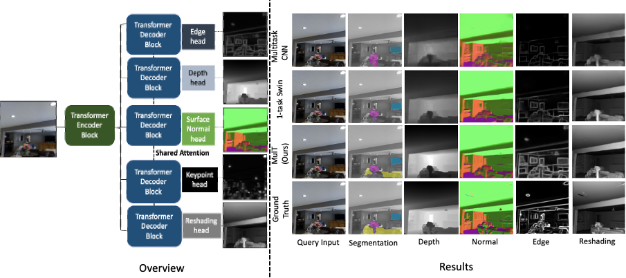

# (CVPR 2022) MulT: An End-to-End Multitask Learning Transformer

[](https://zenodo.org/doi/10.5281/zenodo.11069059)

Deblina Bhattacharjee, Tong Zhang, Sabine Süsstrunk and Mathieu Salzmann

The code is released. Thanks for your patience!

CVPR 2022 Paper: https://openaccess.thecvf.com/content/CVPR2022/html/Bhattacharjee_MulT_An_End-to-End_Multitask_Learning_Transformer_CVPR_2022_paper.html

https://ivrl.github.io/MulT/



##  Citation
If you find this work useful, please cite this paper:
```
  @InProceedings{Bhattacharjee_2022_CVPR,
    author    = {Bhattacharjee, Deblina and Zhang, Tong and S\"usstrunk, Sabine and Salzmann, Mathieu},
    title     = {MulT: An End-to-End Multitask Learning Transformer},
    booktitle = {Proceedings of the IEEE/CVF Conference on Computer Vision and Pattern Recognition (CVPR)},
    month     = {June},
    year      = {2022},
    pages     = {12031-12041}
}
```
## License 
``` 
 [MIT License](https://choosealicense.com/licenses/mit/)
```
